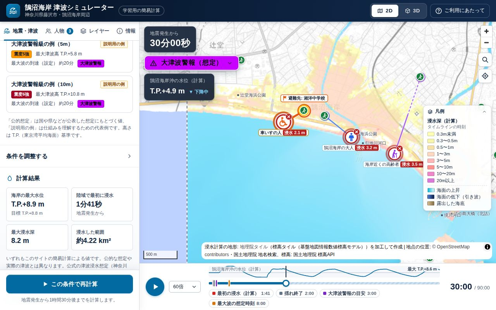
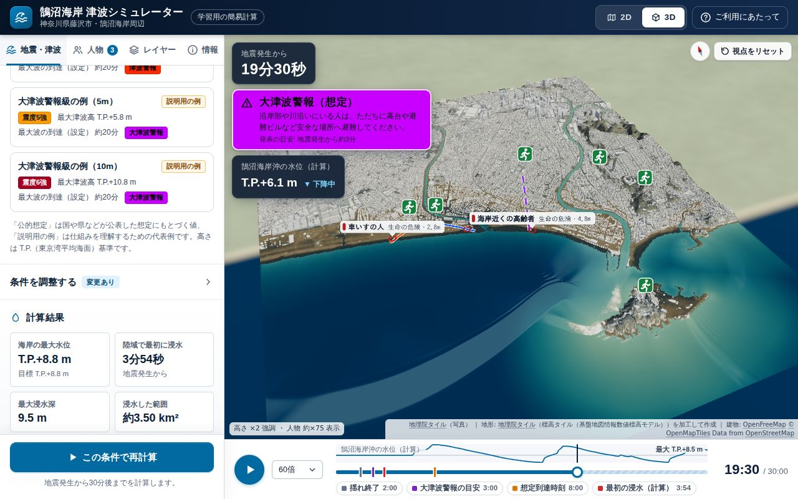
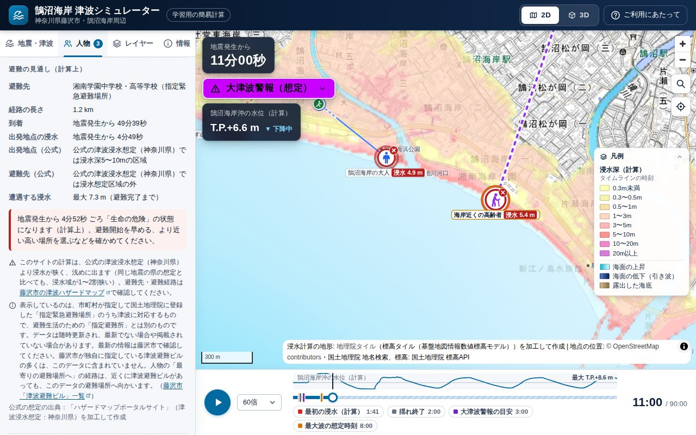
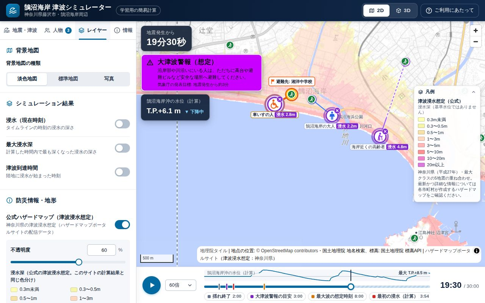
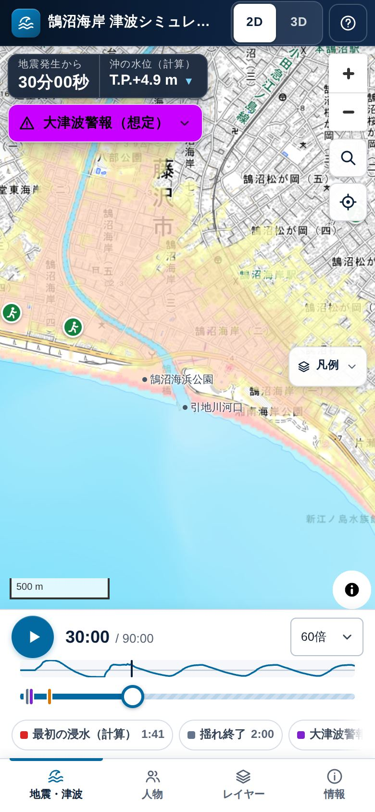
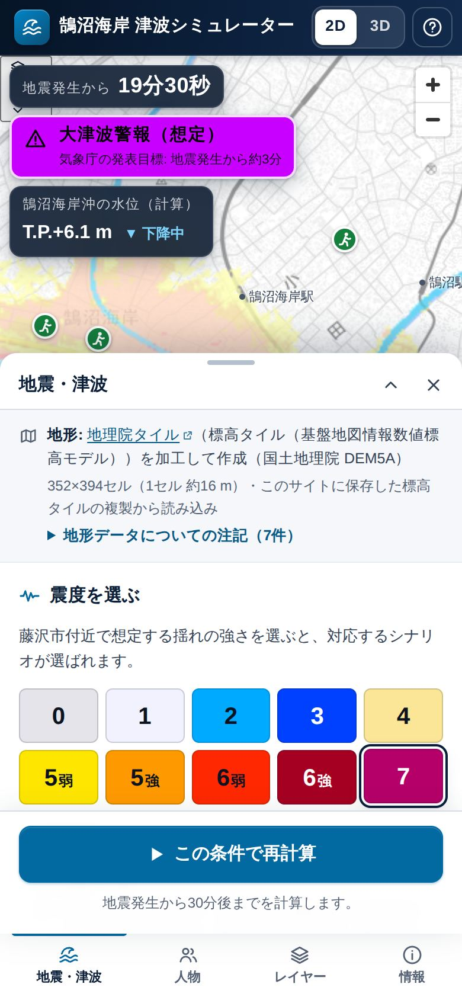

# 鵠沼海岸 津波シミュレーター

神奈川県藤沢市の **鵠沼海岸** 周辺（辻堂〜鵠沼〜片瀬・江の島）を対象に、地震による津波が海岸に押し寄せ、陸に浸水していく様子を
**2D 地図と 3D** のアニメーションで確かめられる、学習・啓発用のウェブアプリです。

- 国土地理院の標高データ（5 m メッシュ）から作った実際の地形の上で、津波の水位と浸水を計算します。
- 震度（0〜7）を選ぶと、神奈川県・内閣府の公的な想定などにもとづくシナリオが選ばれます。
- 地図上に人物（大人・子ども・高齢者・車いす・走って避難）を置き、避難経路と、その場所の浸水の深さ・危険度を確かめられます。
  地名・住所の検索や現在地からも置けます。人物の評価は公式の津波浸水想定とも照らし合わせます（計算だけで「安全」とは示しません）。
- 神奈川県の公式の津波浸水想定（ハザードマップ）を重ねて比べられます。

**公開サイト:** https://hazard-chi.vercel.app/ （Vercel）

> [!IMPORTANT]
> **このサイトは学習用の簡易モデルです。国・県・市の公的な予測や想定ではありません。**
> 計算は地形・海底地形・建物などを簡略化しており、実際の津波の高さ・到達時間・浸水範囲とは異なります。
> 実際の避難には [藤沢市の津波ハザードマップ](https://www.city.fujisawa.kanagawa.jp/bousai/bosai/bosai/hazardmap/tsunami/h25hazardmap.html) を確認し、
> 気象庁の津波警報・注意報と藤沢市の避難情報に従ってください。
>
> **強い揺れや長い揺れを感じたら、津波警報や計算結果を待たずに、ただちに高い所へ避難してください。**

---

## 画面

| 2D 地図: 計算した浸水（陸の浸水が最も広い時刻） | 3D: 地形・建物と津波 |
| --- | --- |
|  |  |
| **人物の評価: 避難の見通しと浸水の深さ** | **公式ハザードマップ（神奈川県の津波浸水想定）を重ねた表示** |
|  |  |

<p>


</p>

スクリーンショットは、既定の条件（震度7: 相模トラフ沿いの海溝型地震（西側モデル）、解像度「標準」、計算時間 90 分）で計算したものです（`npm run screenshots` で撮り直せます）。
背景地図: [地理院タイル](https://maps.gsi.go.jp/development/ichiran.html)（淡色地図・写真）、
地形: 地理院タイル（標高タイル（基盤地図情報数値標高モデル））を加工して作成、
公式ハザードマップ: [ハザードマップポータルサイト](https://disaportal.gsi.go.jp/hazardmap/copyright/opendata.html)（津波浸水想定：神奈川県）、
避難場所: 国土地理院 指定緊急避難場所データ（津波）、
地点の位置: © [OpenStreetMap](https://www.openstreetmap.org/copyright) contributors（国土地理院の地名検索で照合）、
建物（3D）: [OpenFreeMap](https://openfreemap.org) © [OpenMapTiles](https://www.openmaptiles.org/) Data from [OpenStreetMap](https://www.openstreetmap.org/copyright)。
（地理院タイルを含む画面の画像は、出典を明示して掲載しています。参考: 国土地理院「[承認申請Q&A](https://www.gsi.go.jp/LAW/2930-qa.html)」Q1-11）

---

## 6 つの機能と、その実現方法

| 求められた機能 | 実現方法 | 主なコード |
| --- | --- | --- |
| **地理位置情報データ** | 国土地理院の **標高タイル**（DEM5A・5 m メッシュ、航空レーザ測量）を Web メルカトル（ズーム 15）の画素に合わせた計算格子（約 31 / 16 / 8 m）に集計し、実際の地形で計算します。標高タイルはサイト内のミラー（`public/tiles`）から読み、無い場合だけ国土地理院から取得します。背景地図（淡色地図・標準地図・写真・色別標高図）、駅などの主な地点（標高は国土地理院 標高 API）、指定緊急避難場所（津波）も国土地理院のデータです。地図上のカーソル位置の地盤高・浸水深を表示します。地名・住所の検索（国土地理院 地名検索API）と現在地（ブラウザの位置情報）で、地図の場所を探したり人物を置いたりできます。 | `src/terrain/`、`src/core/geo.ts`、`src/data/poi.ts`・`shelters.ts`・`sources.ts`、`src/ui/geoSearch.ts`・`geolocate.ts` |
| **ハザードマップ** | 神奈川県の **公式の津波浸水想定**（平成27年、ハザードマップポータルサイトの配信タイル）を重ねて表示できます（不透明度も調整可）。計算結果からは「最大浸水深」と「津波到達時間」（各地点が最初に 1 cm 以上浸水した時刻）の地図を作り、浸水深は公式と同じ配色（国土交通省「水害ハザードマップ作成の手引き」）で比べられます。避難場所（国土地理院 指定緊急避難場所データ・津波。藤沢市が独自に指定する津波避難ビルの多くは含みません）を地図に表示し（吹き出しと、3D でクリック・タップすると開くカードに、データの利用上の注意と藤沢市の津波避難ビルの一覧へのリンクを表示）、「ご利用にあたって」と「情報」タブから藤沢市の津波ハザードマップへ案内します。地図に重ねるタイルを読み込めないときは、色が無くても浸水しないという意味ではないことを凡例（2D では地図の上にも）に示し、「レイヤー」タブの「再試行」で読み込み直せます。公式の津波浸水想定は、サイト内に複製したタイル（`public/tiles/hazard-tsunami`）の色を浸水深の階級に読み替えて、人物の評価にも使います（下の「人物像」）。 | `src/map2d/`、`src/data/sources.ts`・`officialHazard.ts`・`officialHazardLoad.ts`、`src/ui/panels/layers.ts` |
| **水位のシミュレーション** | 非線形長波（浅水）方程式を TUNAMI-N2 方式の差分法で解き、陸への遡上（浸水）も計算します。沖合の境界から入れる波の大きさは、海岸の最大水位が公的な想定値になるよう自動で調整し、最大の波がシナリオの到達時間（公的資料の最大津波到達時間など）に来るよう時刻を合わせます。計算は Web Worker（大きな格子は複数ワーカーで並列）で行い、結果を逐次受け取りながら再生します。タイムライン・再生速度・鵠沼海岸沖の水位グラフ・警報の表示があります。計算を中止した・途中で失敗した結果は「0〜9分20秒のみ計算（中止）」のように計算した範囲を示し、それより後を「浸水なし」とは扱いません。結果は計算したときの条件・地形と結びつけて扱い、条件を変えると「変更前の条件の結果」と示して再計算を促します。 | `src/sim/`、`src/core/results.ts`、`src/ui/timeline.ts`・`hud.ts` |
| **震度ごとのシミュレーター** | 震度 0〜7（気象庁の10階級）のボタンで、その震度に対応するシナリオを選びます（下の表）。震度ごとに気象庁「震度階級関連解説表」の揺れの説明と配色、揺れのアニメーション（端末の「動きを減らす」設定では揺らさない）、想定される津波警報等の区分を表示します。津波の大きさは震度だけでは決まらないことも説明しています。津波高・到達時間・周期・波の数・初動・潮位・計算時間・解像度・粗度は画面で変更できます。 | `src/data/scenarios.ts`・`intensity.ts`・`warnings.ts`、`src/ui/panels/quake.ts`・`shake.ts` |
| **人物像を地図上に配置** | 「人物」タブで種類を選び、2D 地図または 3D 表示をクリックすると、地震発生時にその場所にいた人を置けます。地名・住所の検索や現在地からも置けます。歩行速度（消防庁の指針の目安など）・避難開始時間（内閣府の被害想定の目安など）・避難のしかた（避難場所へ／高台へ／とどまる）から、地形の勾配や細い川の横断を考慮した経路と到着時刻を求め、時刻ごとの位置・浸水深・状態（避難開始前・避難中・避難完了・浸水・歩行困難・生命の危険。「その場にとどまる」人は浸水するまで「とどまっている」）とグラフを表示します。「最寄りの高台」は公式の津波浸水想定の区域（と周囲 30 m）を除いて選び、出発地点・避難先が公式の想定で何 m の区域かも示します。計算で浸水しなくても、出発地点・避難先が公式の想定で浸水する区域なら、判定を緑（問題なし）にはしません。 | `src/people/`、`src/ui/panels/people.ts`、`src/map2d/people.ts`、`src/view3d/people.ts` |
| **2D と 3D に対応** | 2D は MapLibre GL JS、3D は three.js。ヘッダーのボタンでいつでも切り替えられ、時刻・レイヤー・人物は共通です。3D は地形（鉛直強調 1〜5 倍）・水面・建物（OpenFreeMap。読み込めなかったときは、レイヤーの「建物（3D）」を入れ直すと読み込み直します）・人物の立像・避難経路を表示します。three.js は初めて 3D に切り替えたときに読み込みます。スマートフォン（幅 820 px 未満）では操作パネルが画面下のボトムシートになります。 | `src/map2d/`、`src/view3d/`、`src/ui/` |

### 使い方

1. 初めて開くと「ご利用にあたって」が表示されます。内容を確認して閉じます（ヘッダーの「ご利用にあたって」からいつでも開けます）。
   閉じると（2 回目以降はページを開くと）、既定の条件（震度7: 相模トラフ西側モデル、解像度「標準」、90 分）の計算が自動で始まり、再生されます（「地震・津波」タブで中止して条件を変えられます）。
2. 「地震・津波」タブで **震度** を選ぶか、シナリオを直接選びます。必要なら「条件を調整する」で値を変えます。
3. **シミュレーション実行**。計算が進むにつれて地図に浸水が表示され、自動で再生されます。
   - 途中で中止すると、それまでの結果が「0〜9分20秒のみ計算（中止）」のように計算した範囲つきで残ります。それより後の浸水は計算していません（浸水しないという意味ではありません）。
   - 震度・シナリオ・条件を変えても、再計算するまでは前の条件の結果が表示されたままで、「変更前の条件の結果」と示されます（警報・揺れ・目印も前の条件のまま）。「この条件で再計算」で計算し直します。
   - 解像度を変えると前の結果は消えます（計算中なら、新しい解像度の地形で計算し直します）。
4. 画面下の **タイムライン** で時刻を移動・再生・一時停止できます（キーボード: Space で再生／一時停止、← → で 10 秒、Shift を押しながらで 60 秒移動）。
5. 「人物」タブで人物を置き、避難の見通しと浸水の深さを確かめます（Esc で配置を終了）。
   - 地図の右上の虫めがねのボタン（地名・住所で探す）: 2 文字以上入力すると候補が出ます（計算範囲の中の候補が先で、外の候補には「計算範囲外」と表示）。
     計算範囲の中の場所を選ぶと、地図がその場所へ移り、「ここに人物を置く」で人物を置けます。
   - 現在地のボタン: 押したときだけ位置を 1 回取得します。計算範囲の中なら地図を現在地へ移して人物を置けます（外なら計算範囲を表示します）。
   - 「人物」タブの「地名・住所で探して置く」「現在地に置く」からも同じ操作ができます。外部に送られる情報は下の「公開（デプロイ）」を参照してください。
6. 「レイヤー」タブで最大浸水深・津波到達時間（各地点が最初に浸水した時刻）・公式ハザードマップ・色別標高・避難場所・建物の表示と背景地図を切り替えます。

---

## シナリオ

`src/data/scenarios.ts` の値です。「最大津波高」は海岸付近の最大水位（東京湾平均海面 T.P. からの高さ・潮位を含む）で、
気象庁が発表する「津波の高さ」（平常潮位からの高さ）とは基準が違います。「最大波の到達」は最大の波が海岸に来る時刻で、それより前に小さな波が来ることがあります。
どのシナリオも初期潮位は T.P.+0.85 m（神奈川県の想定の朔望平均満潮位）です。

### 公的な想定にもとづくシナリオ

| シナリオ | 規模 | 震度（藤沢市） | 最大津波高 | 最大波の到達 | 出典 |
| --- | --- | --- | --- | --- | --- |
| 相模トラフ沿いの海溝型地震（西側モデル） | Mw8.7 | **7**（6強〜7） | T.P.+8.8 m | 8分 | [神奈川県「津波浸水予測図」相模トラフ沿いの海溝型地震（西側モデル）（平成27年）ほか](https://www.pref.kanagawa.jp/docs/f4i/cnt/f532320/p892754.html) |
| 相模トラフ沿いの海溝型地震（中央モデル） | Mw8.7 | 7（6強〜7） | T.P.+9.5 m | 23分 | [神奈川県「津波浸水予測図」相模トラフ沿いの海溝型地震（中央モデル）（平成27年）](https://www.pref.kanagawa.jp/docs/f4i/cnt/f532320/p892753.html) |
| 元禄関東地震タイプ（1703年型） | Mw8.5 | 6強（6強〜7） | T.P.+8.0 m | 9分 | [神奈川県「津波浸水予測図」元禄関東地震タイプ（平成27年）](https://www.pref.kanagawa.jp/docs/f4i/cnt/f532320/p892750.html) |
| 大正関東地震タイプ（1923年型） | Mw8.2 | **6強**（6強〜7） | T.P.+6.5 m | 9分 | [神奈川県「津波浸水予測図」大正関東地震タイプ（平成27年）](https://www.pref.kanagawa.jp/docs/f4i/cnt/f532320/p892751.html)／萬年ほか（2013）歴史地震28号 |
| 慶長型地震 | Mw8.5 | 5強（仮置き） | T.P.+8.6 m | 50分 | [神奈川県「津波浸水予測図」慶長型地震（平成27年）](https://www.pref.kanagawa.jp/docs/f4i/cnt/f532320/p892748.html) |
| 明応型地震 | M8.4 | 5強（仮置き） | T.P.+7.5 m | 50分 | [神奈川県「津波浸水予測図」明応型地震（平成27年）](https://www.pref.kanagawa.jp/docs/f4i/cnt/f532320/p892747.html) |
| 南海トラフ巨大地震（内閣府の最大クラス想定） | Mw9.1（津波断層モデル） | **6弱**（5弱〜6弱） | T.P.+7 m | 34分（設定。下の注） | 内閣府 市町村別一覧表（[平成24年](https://www.bousai.go.jp/jishin/nankai/pdf/shichouson_ichiran.pdf)・[令和7年](https://www.bousai.go.jp/jishin/nankai/kento_wg/pdf/ichiran.pdf)） |

- 神奈川県のシナリオの最大津波高・到達時間は、各地震の津波浸水予測図に記載された「藤沢海岸（藤沢地区）」（茅ヶ崎市境〜片瀬漁港海岸西側。鵠沼海岸を含む区間）の値です。
- 震度の括弧内は県の令和7年被害想定などによる藤沢市の震度の幅。慶長型・明応型は公的な震度の推計が無いため、震度5強は仮置きです。
- 南海トラフの 7 m は藤沢市内の海岸（崖なども含む）で最も高い値を 1 m 単位に切り上げたもので、鵠沼海岸の値ではありません（本サイトは安全側としてこの値を目標にしています）。
  内閣府は最大の波の到達時間を公表していないため、「最大波の到達」の 34 分には内閣府の「津波高 +3 m」の到達時間（最短）を代わりに使っています（本サイトの設定）。内閣府の潮位条件は各地の年間最高潮位を参考にした満潮位ですが、本サイトは T.P.+0.85 m で計算します。
- 周期・波の数・揺れの長さ、一部のシナリオの第1波の初動は、公的資料に値が無いための設定値（仮定）です。詳しくは画面の各シナリオの説明と「前提・仮定」を参照してください。
- 周期と波の数: 公的な想定のシナリオはすべて **周期 20 分・6 波** です。最大の波以外は最大の波の 0.4 倍（相模トラフ沿いの地震）・0.5 倍（慶長型・明応型・南海トラフ）で、
  慶長型・明応型は第1波が 0.3 倍の小さな波、第2波が最大です。説明用の例は周期 15 分（遠地津波の例は 20 分）・3 波（1 波ごとに 0.75 倍）です。
  周期は神奈川県の計算波形などから選んだ値です（[docs/MODEL.md](docs/MODEL.md) 4.13）。
- 計算時間の既定値は「最大波の到達 ＋ 周期の 3 倍」を含む最小の選択肢（60 分以上、30・60・90・120 分から）で、相模トラフ沿いの地震（西側・中央・元禄関東・大正関東）と
  説明用の例（遠地津波の例を除く）は **90 分**、慶長型・明応型・南海トラフ・遠地津波の例は 120 分です。
- 画面では、到達時間が公的資料の最大津波到達時間そのもの（神奈川県の 6 つのシナリオ）なら「最大波の到達（想定）」、南海トラフ・説明用の例・値を変えた場合は「最大波の到達（設定）」と表示します。

### 説明用の例（公的な想定ではない）

| シナリオ | 規模 | 震度 | 最大津波高 | 最大波の到達 | 出典 |
| --- | --- | --- | --- | --- | --- |
| 遠地津波の例（2025年 ロシア、カムチャツカ半島東方沖の地震を参考） | Mw8.8 | **0** | T.P.+1.05 m（潮位 + 0.2 m） | 60分（短縮した設定値） | [気象庁「地震・火山月報（防災編）」令和7年7月](https://www.data.jma.go.jp/eqev/data/gaikyo/monthly/202507/202507monthly.pdf) |
| 若干の海面変動の例（0.2m未満） | — | **1・2** | T.P.+0.95 m（潮位 + 0.1 m） | 20分（設定値） | [気象庁「津波警報・注意報、津波情報、津波予報について」](https://www.jma.go.jp/jma/kishou/know/jishin/joho/tsunamiinfo.html) |
| 津波注意報級の例（1m） | — | **3・4** | T.P.+1.85 m（潮位 + 1 m） | 20分（設定値） | 同上（区分の基準） |
| 津波警報級の例（3m） | — | **5弱** | T.P.+3.85 m（潮位 + 3 m） | 20分（設定値） | 同上 |
| 大津波警報級の例（5m） | — | **5強** | T.P.+5.85 m（潮位 + 5 m） | 20分（設定値） | 同上 |
| 大津波警報級の例（10m） | — | 6強（仮置き） | T.P.+10.85 m（潮位 + 10 m） | 20分（設定値） | 同上 |

**太字** の震度は、その震度のボタンで選ばれるシナリオです（震度0〜5強は各区分の津波を体験するための便宜的な割り当てで、震度と津波の大きさは対応しません）。

---

## すぐに試す

必要なもの: Node.js 22.12 以上（Vite 8 は 20.19 以上で動きますが、テストの Vitest 5 は 22.12 以上が必要）、npm。

```sh
npm install        # 依存パッケージのインストール
npm run dev        # 開発サーバー（http://localhost:5173/）
npm run build      # 型チェック + 本番用ビルド（dist/ に出力）
npm run preview    # ビルドしたサイトをローカルで確認（http://localhost:4173/）
npm test           # 単体テスト（Vitest）
npm run e2e        # E2E テスト（Playwright + Chromium。ポート 5190 で開発サーバーを起動）
npm run licenses   # ライブラリのライセンス表示（public/THIRD_PARTY_LICENSES.txt）を作り直す（依存パッケージを更新したとき）
```

- `npm run build` は、配布物に含まれるライブラリがすべて `public/THIRD_PARTY_LICENSES.txt` に載っているかを確かめ、足りなければ失敗します（`npm run licenses` で作り直してください）。

- E2E テストはインターネットに接続しません（外部の地図タイル・避難場所データ・建物データは `e2e/fixtures.ts` の代替データに差し替え、標高タイルと公式の津波浸水想定のタイルは `public/tiles` のミラーを使います）。
  GPU の無い環境でも動くよう、WebGL はソフトウェア描画（SwiftShader）で実行します。初回は `npx playwright install chromium` でブラウザを用意してください。
  E2E のコードの型チェックは `npm run e2e:typecheck` です。
- `npm run screenshots` は、実際の地理院タイル等を読み込んで README のスクリーンショット（`docs/screenshots/`）を撮り直します（インターネット接続が必要）。
  HTTPS プロキシの内側では `HTTPS_PROXY` と、プロキシの CA 証明書のパス `PROXY_CA_CERT` を指定します（`e2e/screenshots.config.ts` を参照）。
- URL に `?terrain=synthetic` を付けると、標高データの代わりに簡易地形モデルを使います（動作確認用）。

### 計算時間の目安

4 コアの仮想マシン（Chromium・ビルドしたサイト）で、相模トラフ西側モデルを既定の 90 分間計算した場合: 解像度「粗い」約 35〜45 秒、「標準」約 2.2 分（3 つのワーカーで並列計算）。
どちらも 10〜16 秒ほどで最初の結果が届き、再生が始まります。「細かい」は標準の約 8 倍（セル数が約 4 倍・時間刻みが約 1/2）かかる見込みで、端末によってはメモリ不足になることがあります。
計算中も、届いた結果から順に再生できます。

---

## 標高データ・公式の浸水想定のミラーを作り直す

`public/tiles/` には、次の 2 種類のタイルを同梱しています（取得結果の一覧は `public/tiles/manifest.json`。1 = 保存済み、0 = 配信元にもデータなし）。

- 計算に使う国土地理院の標高タイル（DEM5A/5B/5C・DEM10B。約 2.4 MB）。サイトはまずここを読み、無いタイルだけを国土地理院から取得します（どちらも無理なら簡易地形モデル）。
- 人物の評価に使う公式の津波浸水想定のタイル（`hazard-tsunami`、ズーム 15。ハザードマップポータルサイトの神奈川県の津波浸水想定）。
  計算範囲を覆う 48 枚のうち浸水想定のある 17 枚（約 40 KB）を保存し、残りの 31 枚は配信元にも無い（404）ので manifest に 0 と記録しています（2026 年 9 月 24 日取得）。
  ミラーに無いタイルは配信元から取得し、どちらからも取得できない範囲は「不明」（浸水しないとは扱わない）です。

作り直すには（Node.js 20 以上）:

```sh
node scripts/prefetch-dem.mjs                        # 取得（保存済みのタイルと「データなし」と記録したタイルはスキップ）
node scripts/prefetch-dem.mjs --only dem             # 標高タイルだけ
node scripts/prefetch-dem.mjs --only hazard          # 公式の津波浸水想定のタイルだけ
node scripts/prefetch-dem.mjs --only hazard --force  # 公式の津波浸水想定を取り直す（配信元のデータが更新されたとき）
node scripts/prefetch-dem.mjs --force                # すべて取り直す
node scripts/prefetch-dem.mjs --dry-run              # 取得せずに URL の一覧だけ表示（--json で JSON）
NODE_USE_ENV_PROXY=1 node scripts/prefetch-dem.mjs   # HTTPS プロキシの内側で（Node.js 22.21 / 24.5 以降）
```

- 保存済みのタイルは取り直さないので、配信元の更新を取り込むには `--force` を付けます（`--only` で選ばなかったレイヤーの記録はそのまま残ります）。
- 保存先は `--out <ディレクトリ>` で変えられます（既定は `public/tiles`）。配信元への配慮のため、同時接続は 4 以下で、リクエストごとに待ち時間を入れています。
- 取り直した後は `npm test` を実行してください（`tests/official-hazard.test.ts` は同梱のミラーの枚数・色を確かめています）。

計算範囲（`src/core/geo.ts` の `DOMAIN_BOUNDS`）を変えたときも再実行してください。詳しくは [public/tiles/README.md](public/tiles/README.md)。
なお、背景地図のタイル（淡色地図・標準地図など）は測量法上の扱いが異なるため、保存して配布しないでください（[DATA_SOURCES.md](docs/DATA_SOURCES.md)）。

---

## データの出典

主なデータは次のとおりです。URL・利用条件・出典の書き方・確認した内容は [docs/DATA_SOURCES.md](docs/DATA_SOURCES.md) にまとめています。
画面では、地図の出典表示と「情報」タブに出典を表示しています。

- **国土地理院**: 地理院タイル（淡色地図・標準地図・写真・色別標高図）、標高タイル（DEM5A ほか。**加工して利用**）、標高 API、指定緊急避難場所データ（津波）。
  [国土地理院コンテンツ利用規約](https://www.gsi.go.jp/kikakuchousei/kikakuchousei40182.html) に従って利用しています。
  標高タイルは「地理院タイル（標高タイル（基盤地図情報数値標高モデル））を加工して作成」。
- **指定緊急避難場所データ（津波）**: 市町村が登録した情報で、最新でない場合や掲載されていない場合があります（国土地理院の「ご利用上の注意」。画面では避難場所の吹き出し・3D のカード・「人物」タブに表示しています）。
  計算範囲には 7 か所があり、藤沢市が独自に指定している **津波避難ビルの多くは含まれていません**。最新の避難場所・津波避難ビルは
  [藤沢市の津波避難ビルのページ](https://www.city.fujisawa.kanagawa.jp/kikikanri/bosai/bosai/tunamihinanbiruichiran.html) や津波ハザードマップで確認してください。
- **国土地理院 地名検索API（協力: 東大CSIS「[シンプルジオコーディング実験](https://geocode.csis.u-tokyo.ac.jp/home/simple-geocoding/)」）・国土地理院 逆ジオコーダー**: 地名・住所の検索と、人物の場所の住所（町字）の目安。
  地理院地図のための機能で、国土地理院は常に・長期的に提供できるとは限らず、仕様も予告なく変わることがあるとしています（[gsimaps の README](https://github.com/gsi-cyberjapan/gsimaps)）。
- **ハザードマップポータルサイト**: 重ねるハザードマップの津波浸水想定（神奈川県、平成27年）。公共データ利用規約（第1.0版）。
  人物の評価（公式の浸水想定区域の判定）には、このタイルをサイト内に複製したもの（`public/tiles/hazard-tsunami`）の色を浸水深の階級に読み替えて使っているので、
  画面では「「ハザードマップポータルサイト」（津波浸水想定：神奈川県）を加工して作成」と表示しています。
- **神奈川県・藤沢市・内閣府・気象庁・国土交通省・消防庁** の公表資料: シナリオの値、震度の説明、津波警報等の区分、浸水深の配色、粗度係数、歩行速度・避難開始時間・浸水深の区分。
  各値の出典（資料名・ページ）は `src/data/*.ts`・`src/people/profiles.ts` のコメントと画面に記載しています。
- **OpenFreeMap / OpenMapTiles / OpenStreetMap**: 3D の建物（ODbL）。OSM に高さの無い建物は一律 5 m で、実際の高さではありません。
- **OpenStreetMap**（Nominatim で確認）: 駅などの地点の位置（© OpenStreetMap contributors）。

**海の水深は国土地理院のデータではなく、汀線からの距離に応じた推定値です。**
このサイトの計算結果は、国土地理院・神奈川県などが作成したものではありません。

---

## 計算モデルの概要と限界

詳しくは [docs/MODEL.md](docs/MODEL.md) を参照してください。

- **地形**: 標高タイルを計算セルに平均し、水面（無効値）から海・河川と池を分類。海底は Dean の平衡海浜断面などにもとづく推定の断面。粗度係数は海域 0.025、陸域は一律（既定 0.06＝中密度の住宅地）。
- **津波**: 非線形長波方程式（TUNAMI-N2 方式: スタッガード格子・リープフロッグ・1次風上差分・マニング則の半陰的な摩擦・乾湿の先端条件）。
  沖合約 2 km の境界から正弦波列を入れ（Flather 型の放射境界）、鵠沼海岸付近の最大水位（90 パーセンタイル）が目標値に近づくよう振幅を試算で調整し、
  最大の波（既定では第1波。慶長型・明応型は第2波）の山が、シナリオの到達時間（公的資料の最大津波到達時間など）に届くよう入力の開始時刻を合わせます。
- **人物**: 地形格子上の 8 近傍の最短経路（勾配・細い川の横断を考慮）と一定の歩行速度で位置を求め、その場所の浸水深を 0.01 / 0.3 / 1.0 m で区分します。
  「最寄りの高台」は、計算で浸水しない場所（計算結果が無いときは、最大津波高 ＋ 1 m 以上の高さの場所）のうち、公式の津波浸水想定の区域と周囲 30 m
  （公式のデータを取得できなかった範囲も含む）を除いた場所から選びます。
  公式のデータを読み込めないときは除けないので、避難先の名前に「…公式の浸水想定区域の外かは未確認」と示します。

主な限界:

- 断層運動・震源からの伝播は計算せず、波形は単純化した正弦波列です。公的な想定のシナリオでは最大の波は 1 つだけ
  （相模トラフ沿いの地震・南海トラフは第1波、慶長型・明応型は第2波）で、後の波は最大の波の 0.4〜0.5 倍の設定です（周期 20 分・6 波。公的資料に値が無いための仮定）。
  実際には後の波の方が高いことがあり、津波は数時間以上くり返し来ます。
- 海岸の最大水位は、公的な想定の代表値に「合わせて」いるだけです。区間の外（辻堂・片瀬・江の島）や個々の地点では目標と異なります。
- 海底地形は推定値で、建物・堤防・水門・道路の盛土・地下街は表現していません（セル平均の地形と一律の粗度のみ）。潮汐の変化・地盤の沈降・隆起も考慮しません。
- 人物の経路は道路網・建物・混雑・夜間・揺れの被害を考慮しない概算です。状態の判定は計算上の目安で、個人の実際の被害や生死を予測するものではありません。
  「最寄りの避難場所へ」の目的地は国土地理院の指定緊急避難場所（津波）だけ（計算範囲に 7 か所。2026 年 9 月に確認）で、藤沢市の津波避難ビルの多くは含まれていません
  （実際にはもっと近くに避難できる建物があることがあります）。
  「最寄りの高台」を公式の浸水想定区域の外から選んでも、そこが安全とは限りません（公式の想定も想定で、地盤の凹凸や建物の影響でより広く・深く浸水する場合があります）。
- **このサイトの計算は、公式の津波浸水想定より浸水が狭く、浅めです。** 公式の津波浸水想定（神奈川県）は 5 つの地震の結果を重ね合わせた最大の浸水ですが、
  同じ相模トラフ西側モデルの地震だけを描いた県の津波浸水予測図と、既定の条件（西側モデル・解像度「標準」）の計算を比べても、
  予測図で浸水する範囲の約 17%（鵠沼付近で約 12%）がこの計算では浸水せず（浸水域が 1〜2 割狭い）、
  両方で浸水する場所の約 4 割では浸水深の階級が予測図より浅くなります（計算の浸水域の約 95% は予測図の浸水域の中です）。
  差は主に公式の浸水域の外側の縁と、地盤の高い所です（[docs/MODEL.md](docs/MODEL.md) 4.13.5）。
  **公式の浸水想定の方が広く深いことを前提に、避難には公式のハザードマップを使ってください。** 比べるときは「公式ハザードマップ」レイヤーを重ねてください。

---

## ディレクトリ構成

```
├── index.html                 ページの骨組み
├── src/
│   ├── main.ts                起動（ストア・コントローラ・UI・2D/3D ビューの組み立て。window.__app を公開）
│   ├── core/                  型（types.ts）・座標（geo.ts）・状態ストア・コントローラ（状態遷移と非同期処理）・結果の判定（results.ts）
│   ├── terrain/               標高タイルの取得・デコード・集計・水域の分類・海底地形の推定・簡易地形モデル
│   ├── sim/                   津波の計算（solver.ts 差分スキーム、engine.ts 校正と出力、band.ts 並列計算、worker.ts）
│   ├── people/                人物の種類・経路探索・状態の判定
│   ├── data/                  シナリオ・震度・警報・出典とタイル・地点・避難場所（公式資料で確認した値）
│   ├── map2d/                 2D 地図（MapLibre GL JS）
│   ├── view3d/                3D 表示（three.js）
│   ├── ui/                    操作パネル・HUD・タイムライン・ダイアログ
│   └── styles/                CSS
├── public/tiles/              国土地理院 標高タイルと公式の津波浸水想定タイル（hazard-tsunami）のミラー（manifest.json とタイル）
├── public/THIRD_PARTY_LICENSES.txt  サイトに含まれるライブラリのライセンス表示（npm run licenses で作り直す）
├── scripts/prefetch-dem.mjs   標高タイル・公式の津波浸水想定タイルのミラーを作るスクリプト
├── tests/                     単体テスト（Vitest）
├── e2e/                       E2E テスト（Playwright）と README 用スクリーンショットの撮影
├── docs/
│   ├── DATA_SOURCES.md        データの出典と利用条件
│   ├── MODEL.md               計算モデルの説明
│   └── screenshots/           README のスクリーンショット
├── playwright.config.ts       E2E テストの設定
└── vite.config.ts             ビルド設定（base: './'）
```

使っている主なライブラリ: [Vite](https://vite.dev/)、TypeScript、[MapLibre GL JS](https://maplibre.org/)、[three.js](https://threejs.org/)、
@mapbox/vector-tile・pbf（建物のベクトルタイル）、Vitest、Playwright。
サイトに含まれるライブラリ（MapLibre GL JS が内部に含むものを含む）の著作権表示とライセンス条文は
[`public/THIRD_PARTY_LICENSES.txt`](public/THIRD_PARTY_LICENSES.txt)（公開したサイトでは `./THIRD_PARTY_LICENSES.txt`）にまとめています。

---

## 公開（デプロイ）

### Vercel（現在の公開先）

Vercel のプロジェクト `hazard`（チーム r-ishii's projects）に GitHub リポジトリ `r-ishii-01/Hazard` を連携して公開しています。

- 公開 URL: https://hazard-chi.vercel.app/ （誰でも閲覧できます）
- 本番ブランチ（リポジトリの既定ブランチ）へプッシュすると、Vercel が自動でビルド（`npm run build`、フレームワーク: Vite、出力: `dist/`）して本番を更新します。
- それ以外のブランチのプッシュはプレビューとしてデプロイされます。プレビューの URL（`*-r-ishiis-projects.vercel.app`）はチームの既定の保護設定により Vercel へのログインが必要です。
- 設定の変更（独自ドメイン・保護設定など）は Vercel のダッシュボードのプロジェクト `hazard` から行えます。

### そのほかの静的ホスティング

`npm run build` で `dist/` に静的なファイル一式ができます。サーバー側の処理は不要なので、GitHub Pages・Netlify・Cloudflare Pages・
任意の Web サーバーなどの **静的ホスティング** にそのまま置けます。

- `vite.config.ts` は `base: './'`（相対パス）なので、`https://example.com/tsunami/` のようなサブパスにも置けます。
- `public/` の内容（標高タイルと公式の津波浸水想定タイルのミラー `tiles/` を含む）は `dist/` にそのままコピーされます。
- 計算用の Web Worker は ES モジュール形式（`worker.format: 'es'`）で、ビルド後も別ファイルとして読み込まれます。
- 背景地図・地図に重ねる公式ハザードマップ・避難場所・建物のデータは、閲覧時にブラウザが各配信元（国土地理院・ハザードマップポータルサイト・OpenFreeMap）から直接読み込みます
  （いずれも CORS に対応）。これらに接続できない環境でも、標高データはミラーから読むので計算はでき、人物の評価に使う公式の津波浸水想定もミラーから読みます
  （避難場所は内蔵の写しを使います。地図に重ねる公式ハザードマップを読み込めないときは、その旨を画面に示します）。
- ブラウザから外部へ送られる情報: 地名・住所の検索では入力した文字を国土地理院の地名検索API（`msearch.gsi.go.jp`）へ、
  地図のクリックや検索で置いた人物については、その位置の座標を住所の目安を調べるために国土地理院の逆ジオコーダー（`mreversegeocoder.gsi.go.jp`）へ送ります。
  地名検索は 2 文字以上入力すると、入力の途中でも候補を探すために送ります。
  現在地（ブラウザの位置情報）は現在地のボタン（「人物」タブの「現在地に置く」を含む）を押したときだけ 1 回取得し、座標はどこにも送らず、保存もしません。現在地に置いた人物の住所も調べません
  （あとで動かしても調べません）。ただし、現在地の周辺を地図に表示すると（現在地が計算範囲の中なら、取得したときに地図が現在地へ移動します）、
  その範囲の地図画像を配信元（国土地理院など）から読み込むため、おおよその場所（数百 m 程度）は配信元に伝わります（地図を動かして表示したときと同じです）。
  このことは、画面の現在地のパネル・「人物」タブ・「情報」タブにも書いています。
- 出典表示を消さないでください（国土地理院コンテンツ利用規約・各データの利用条件で求められています）。
- `public/THIRD_PARTY_LICENSES.txt`（ライブラリのライセンス表示）も `dist/` にコピーされます。消さずに一緒に公開してください。
  ビルドした JavaScript には、MapLibre GL JS・three.js の `@license` の表示も残しています（`vite.config.ts`）。

---

## 注意事項（免責）

- このサイトは、津波の仕組みや早めの避難の大切さを学ぶための **学習用の簡易モデル** です。**公的な予測・想定ではありません。**
- 計算結果は実際の津波とは異なります。「ここまでなら安全」という判断には使わないでください。
- 実際の避難は、**[藤沢市の津波ハザードマップ](https://www.city.fujisawa.kanagawa.jp/bousai/bosai/bosai/hazardmap/tsunami/h25hazardmap.html)** で避難場所・避難経路を確認し、
  [気象庁の津波警報・注意報](https://www.jma.go.jp/jma/kishou/know/jishin/joho/tsunamiinfo.html) と藤沢市の避難情報に従ってください。
- **強い揺れや長い揺れを感じたら、ただちに高台や津波避難ビルなど高い所へ避難してください。** 津波警報の発表や、このようなシミュレーションの結果を待つ必要はありません。
